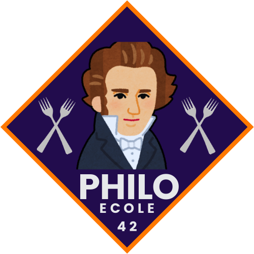

  
  <h2>42 PHILOSOPHERS PROJECT</h2>
    
    
    
    
    
   
<h4>
    <a href="https://github.com/emre-mr246/42_ring3_philosophers/issues">❔ Ask a Question</a>
   · 
    <a href="https://github.com/emre-mr246/42_ring3_philosophers/issues">🪲 Report Bug</a>
   · 
    <a href="https://github.com/emre-mr246/42_ring3_philosophers/issues">💬 Request Feature</a>
</h4>

## Introduction 🚀

The 42 Philosophers project is a simulation of the classic Dining Philosophers problem, which illustrates the challenges of concurrency, synchronization, and resource sharing in a multithreaded environment. The project involves a set number of philosophers who alternately think and eat, but to eat, they need access to limited resources (forks). The goal is to manage these resources and avoid deadlocks or race conditions while ensuring that no philosopher starves. This project tests skills in multithreading and mutexes.

## Usage 🔍

1.  In the project's main directory, compile the library using the `make` command.
   `$ make` 
    
2.  After compilation, you can use the program as follows:
    `./philo <philo_count> <time_to_die> <time_to_eat> <time_to_sleep>`
